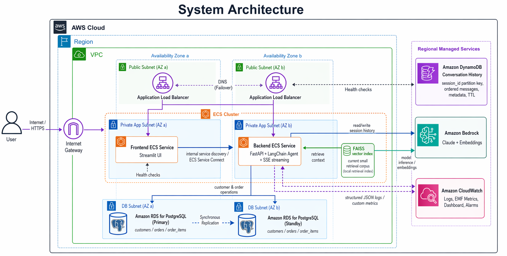

# Technical Document

**Project**: Agentic Conversational System  
**Assignment**: Cloud Kinetics SA AI/Data Intern Assignment  
**Candidate**: `Nguyen An`  
**Repository**: [Repository](https://github.com/anngyn/Intelligent-Conversation-Agent/) 
**Demo Video**: [Video Demo](https://drive.google.com/drive/folders/1Yz3UMZMw3nhW4KOxQIreBRK69uvde9ki?usp=drive_link)
**Date**: April 22, 2026

## 1. Solution Overview

This solution handles two e-commerce support workflows:
- grounded Q&A over company documents
- secure order status lookup with identity verification

System includes:
- Streamlit frontend
- FastAPI backend with streaming responses
- AWS Bedrock for model inference and embeddings
- FAISS for current vector retrieval
- DynamoDB for conversation history
- PostgreSQL for customer and order operational data
- Terraform for AWS deployment
- CloudWatch for logs, metrics, dashboard, and alarms

Implemented scope covers:
- Level 100 core agent capability
- Level 200 AWS deployment and CI/CD
- Level 300 baseline for persistence and observability

## 2. Architecture

### Runtime flow
`User -> ALB -> frontend ECS service -> backend ECS service -> Bedrock`

### Data split by access pattern

| Data type | Store | Reason |
|---|---|---|
| Conversation history | DynamoDB | Session-based append and ordered read |
| Customer and order operations | PostgreSQL | Relational integrity and indexed lookup |
| Vector retrieval corpus | FAISS | Small corpus and lowest cost floor |

### Architecture diagram

## 3. Design Decisions

### DynamoDB for conversation history

Conversation history has simple access pattern:
- append by session
- replay ordered messages by session
- expire old sessions automatically

Chosen structure:
- partition key: `session_id`
- sort key: ordered message key
- attributes: role, content, metadata, ttl

Why not PostgreSQL:
- higher operational overhead for this workload
- weaker fit for session-based append/replay

### PostgreSQL for customer and order operations

Customer and order data is operational business data. It benefits from:
- relational structure
- indexing
- integrity constraints

Chosen model:
- `customers`
- `orders`
- `order_items`

Why not DynamoDB:
- business relationships and indexed operational lookup matter here

### FAISS now, OpenSearch later

FAISS is current implementation because corpus is still small.

Why FAISS now:
- simple
- cheap
- enough for assignment scale

Why OpenSearch later:
- good managed vector option
- cost floor too high for current scope
- should be introduced only when corpus size, filtering, or concurrency justify it

### ECS Fargate for deployment

ECS Fargate chosen because application has:
- always-on frontend/backend runtime
- streaming behavior
- clear container boundaries

This is simpler than forcing same shape into Lambda.

## 4. Implementation Details

### Frontend
- Streamlit chat UI
- sends chat requests to backend
- renders streaming responses

### Backend
- FastAPI API layer
- LangChain-based agent orchestration
- retrieval tool for document Q&A
- order lookup tool for operational workflow
- session-aware conversation handling

### Data persistence
- conversation history persisted in DynamoDB
- order and customer operations stored in PostgreSQL

### Security
- order lookup requires identity verification before returning operational data
- logs redact PII
- backend service remains private
- IAM follows least-privilege model

### Observability baseline
- structured JSON logs
- PII redaction
- EMF custom metrics
- CloudWatch dashboard
- CloudWatch alarms

## 5. Validation and Trade-offs

### Validation

Validated locally:
- backend persistence tests pass
- order store tests pass
- terraform configuration validates successfully

Validated artifacts:
- README aligned to current architecture
- architecture PNG included
- docs aligned to current design decisions

Not fully validated yet in AWS:
- full `terraform apply` smoke test in a real account
- end-to-end GitHub Actions deployment run

### Trade-offs

Implemented now:
- AWS-native persistence for chat history and operational data
- AWS-native deployment path
- practical observability baseline
- cost-aware vector retrieval choice

Not implemented now:
- OpenSearch vector database
- X-Ray tracing
- LangSmith tracing
- richer alert routing and evaluation pipeline

Reason:
- current scope favors clear architecture thinking and right-sized implementation over overbuilding

### Scalability path
- DynamoDB scales conversation throughput
- PostgreSQL scales operational data path
- ECS services scale frontend and backend horizontally
- OpenSearch remains future step when retrieval workload grows beyond FAISS sweet spot

## 6. Closing

Main architecture decision in this project was to separate conversation state, operational business data, and retrieval data by access pattern, then keep current implementation cost-aware while preserving a clear path to production scale.
